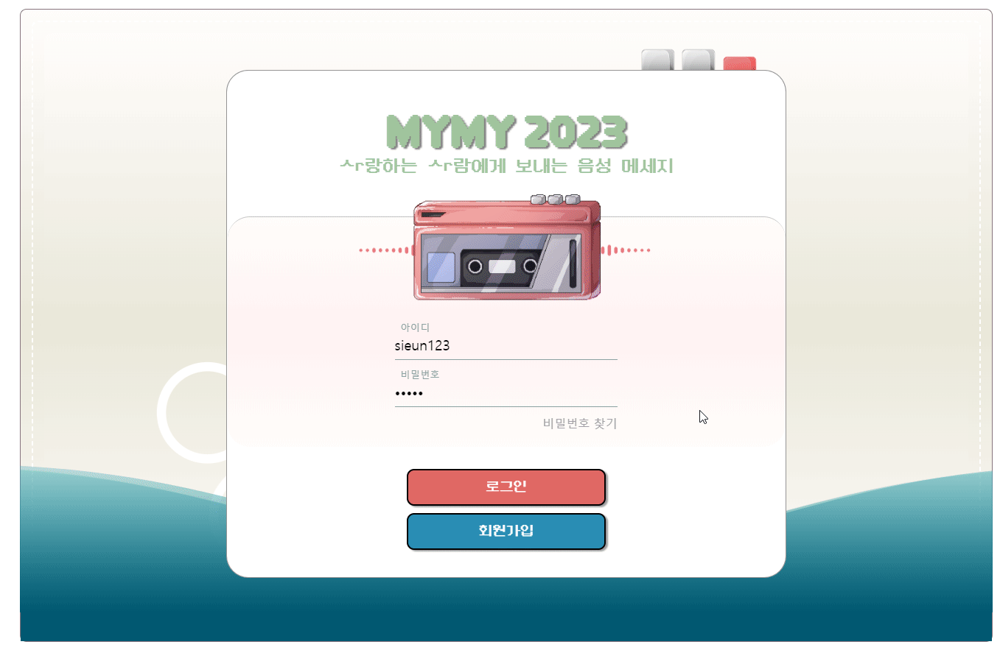
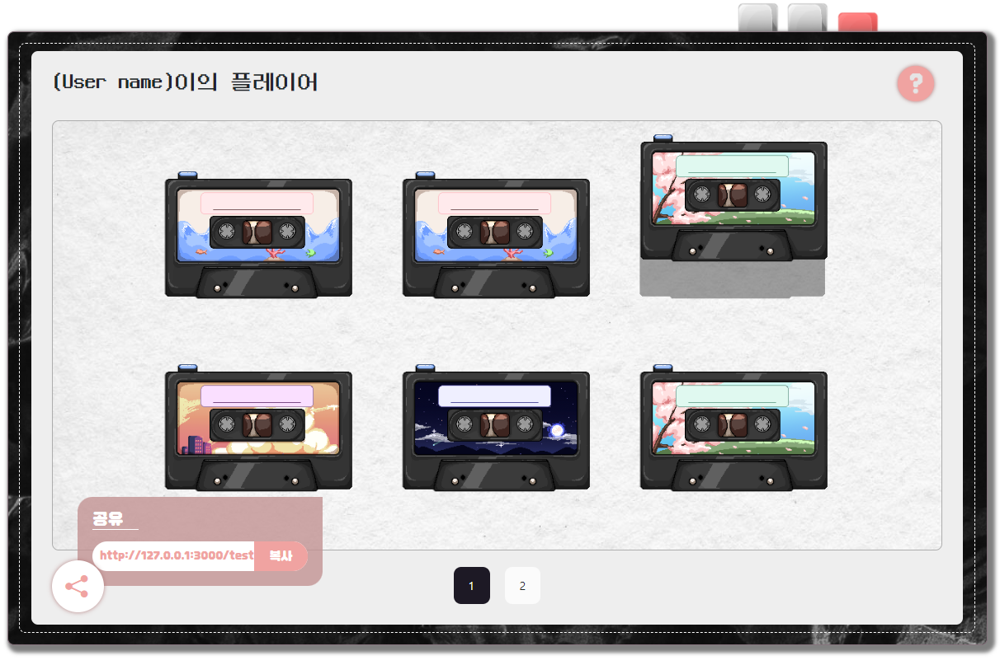
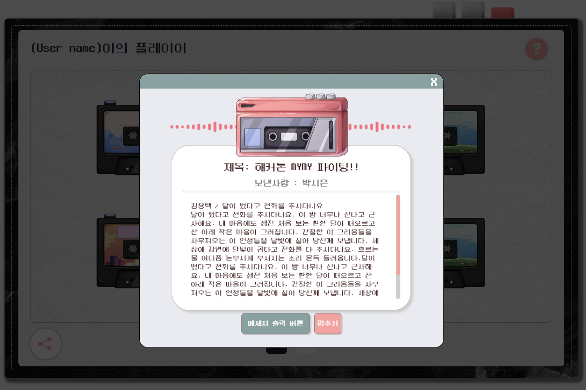
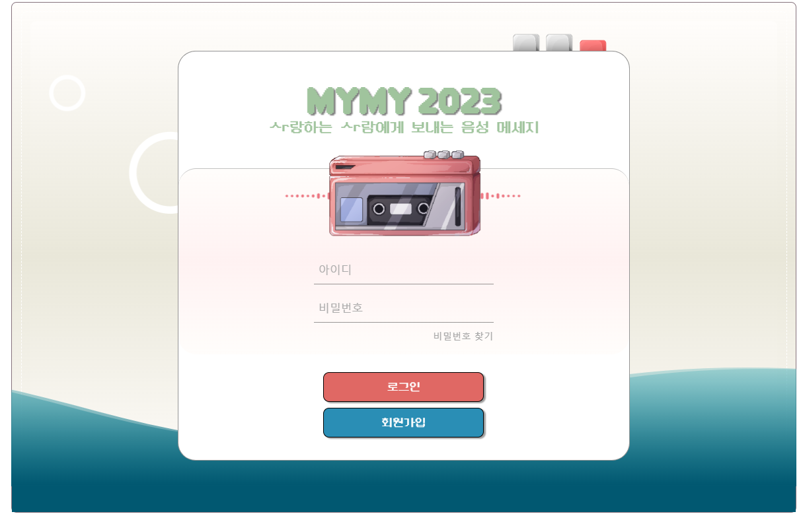
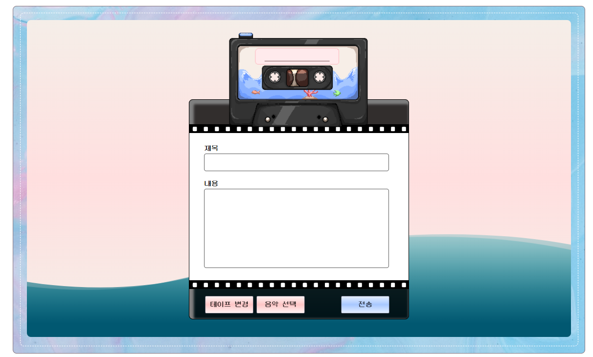
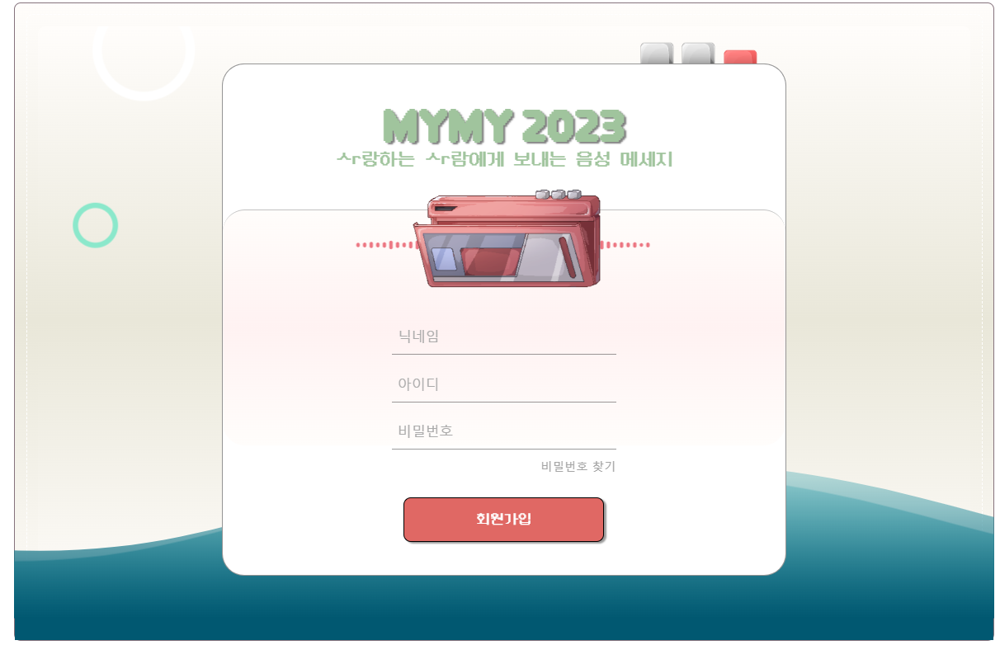
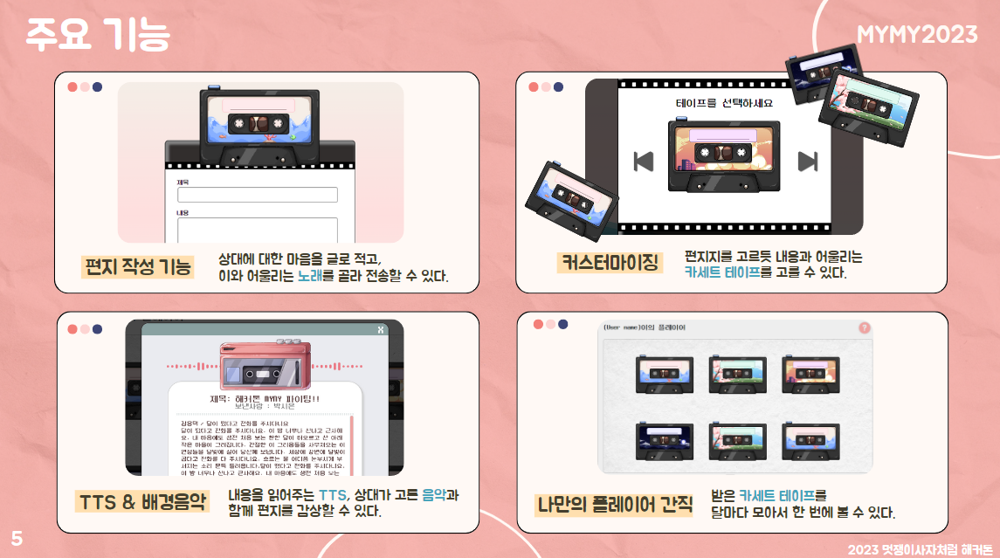
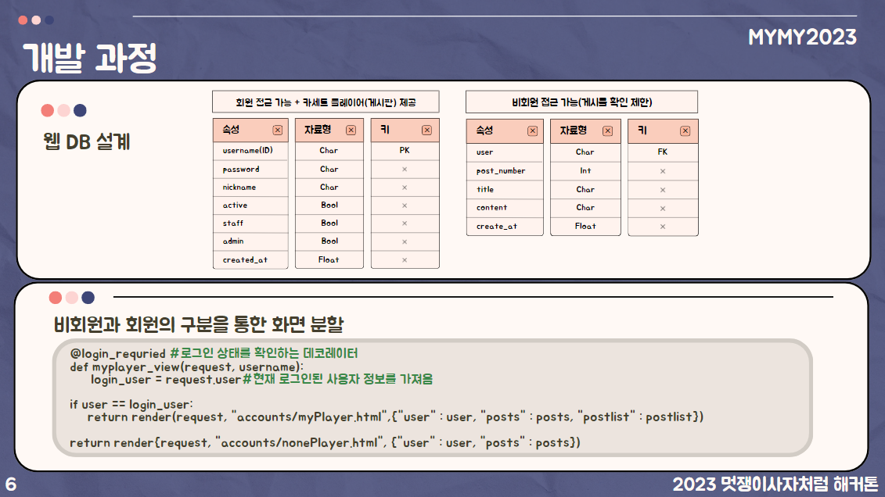

# MYMY - TTS 기반 편지 보내기 서비스

## 📻 프로젝트 소개

"복잡한 기능으로 구성되고, 시각 의존적인 기존 sns를 디지털 약자를 위한 청각 중심으로 보완한 서비스로, 테이프로 마음을 담아 메세지를 보내고 음성과 bgm으로 확인할 수 있는 TTS를 기반으로 한 편지 보내기 서비스" 입니다.  [발표 PPT 링크](https://www.canva.com/design/DAFrsFPENYs/07qZoXXaTdXAgcFoLGbSzA/edit?utm_content=DAFrsFPENYs&utm_campaign=designshare&utm_medium=link2&utm_source=sharebutton)

## 🎀 팀원

| 노주희 |  박시은  |  신민서  | 나용성  | 김은서  | 조준형  |
| :----: | :------: | :------: | :-----: | :-----: | :-----: |
| Leader | Frontend | Frontend | Backend | Backend | Backend |

## ⏰ 개발 기간

2023.08.07 ~ 2023.08.18 (12일)

## ⚙️ 기술 스택

   

## 🗒️ 구현 항목

### 🔽 회원

- 로그인
  - 로그인을 통해 사용자 개인의 카세트 플레이어를 제공합니다.
- 테이프 공유
  - 공유 버튼을 클릭하면 특정 링크를 통해 비회원들이 테이프를 생성하여 메시지를 남길 수 있습니다.
- 받은 테이프 확인
  - 로그인한 사용자는 받은 테이프를 자신의 카세트 플레이어에서 확인할 수 있습니다.
- 테이프 플레이
  - 플레이어에서 특정 테이프를 선택하면 해당 테이프의 음성 메시지를 BGM과 함께 들을 수 있습니다.

|  |  |
| :---------------------------------------: | :----------------------------------: |

### 🔽 비회원

- 테이프 생성
  - 회원이 공유한 링크를 통해 비회원들도 테이프를 생성할 수 있습니다.
- 테이프 커스터마이징
  - 테이프를 생성할 때, 사용자는 음악을 선택하고 테이프를 커스터마이징할 수 있습니다.
- 로그인 및 회원가입
  - "로그인 하기" 버튼을 클릭하면 사용자는 회원가입을 할 수 있으며, 이를 통해 자신만의 카세트 플레이어를 만들 수 있습니다.

|            로그인 / 회원가입            |               테이프 생성                |
| :-------------------------------------: | :--------------------------------------: |
|   |  |
|  |                                          |

### 🔽 주요 기능

### 🔽 개발 과정

### 🔽 개발 로직

